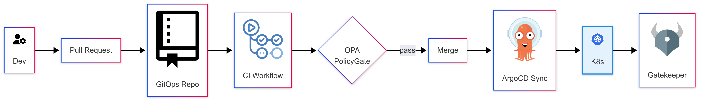
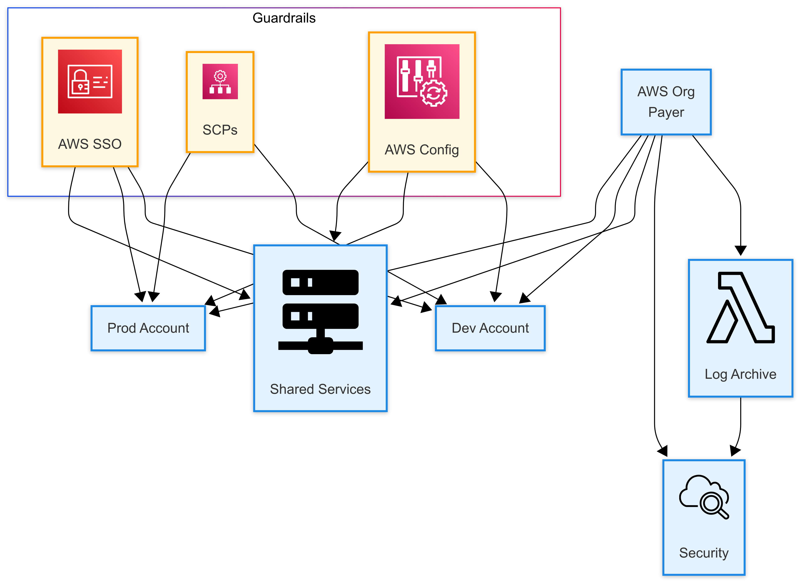

# Senior DevOps Consulting

I’m **Seif Eddine Shili** – a senior DevOps/SRE engineer who helps teams achieve *zero-downtime* releases and robust cloud foundations **between Friday 18:00 and Sunday 18:00 CET**.
_Also available Mon–Thu 20:00–22:00 CET for small, quick tasks._

---

## 🔧 What I Deliver

| Package                              | Scope                                                                                                                          | Price             |
|--------------------------------------|--------------------------------------------------------------------------------------------------------------------------------|-------------------|
| **Grafana Dashboard Setup & Tuning** | • Install/configure Grafana on your server (or Docker) • Connect one data source (e.g., Prometheus, MySQL) • Build 3 custom dashboards (CPU/Memory, App errors, Network) • Configure 2 alerts (email/Slack) • Deliverables: JSON exports, `docker-compose.yml` (or install script), alert definitions, short README | **€ 450** (4–5 h) |
| **K8s Manifest Audit & Optimization** | • Review up to 10 Kubernetes YAML/Helm manifests • Identify missing resource requests/limits, probes, and basic `securityContext` • Provide 1-page PDF with 5–7 actionable fixes (e.g., resource limits, `readinessProbe`, `runAsNonRoot`, `NetworkPolicy`) • 30 min video call to walk through recommendations | **€ 300** (3 h)   |
| **Jenkins Pipeline Build & Integration** | • Install/configure Jenkins (Docker or existing VM) • Create a `Jenkinsfile` that checks out code, runs tests, builds a Docker image, and pushes it to a registry • Provide 2 example `Jenkinsfile`s and necessary config snippets • Deliverables: Jenkins setup instructions, pipeline scripts, short README | **€ 380** (4 h)   |
| **Terraform + Ansible Starter Pack**    | • **Terraform**: Script to provision an Ubuntu VM (AWS/DigitalOcean/other) with security group and SSH key • **Ansible**: Playbook to install Docker, Git, and nginx (or 2–3 packages) on that VM • “How-to” guide (`terraform init && terraform apply`, then `ansible-playbook -i inventory site.yml`) • Deliverables: Terraform files, `site.yml`, `inventory.ini`, short README | **€ 500** (5 h)   |

---

### 🔐 Add-On Security Hardening

- **Kubernetes Basic Hardening** – € 200 (2 h)
  • Add `securityContext.runAsNonRoot: true` (and/or `allowPrivilegeEscalation: false`)
  • Define resource requests/limits (`requests.cpu/memory`, `limits.cpu/memory`)
  • Create a `NetworkPolicy` to restrict pod-to-pod traffic
  • Deliverables: Hardened YAML manifests, 1-page PDF summarizing changes and rationale

- **Jenkins Security Hardening** – € 200 (2 h)
  • Disable anonymous read access and enable matrix-based security (Role-Strategy Plugin)
  • Configure HTTPS/TLS for Jenkins (self-signed or Let’s Encrypt)
  • Deliverables: PDF with screenshots of security settings and sample `jenkins.yaml` snippets

- **Terraform + Ansible Security Enhancements** – € 200 (2 h)
  • Restrict cloud security group to SSH (port 22) from client IP, allow 80/443 only
  • Use Ansible to install and configure UFW on Ubuntu (deny incoming, allow SSH/HTTP/HTTPS, enable)
  • Enforce key-only SSH (`PasswordAuthentication no` in `/etc/ssh/sshd_config`)
  • Deliverables: Updated Terraform files, enhanced Ansible playbook, 1-page security PDF

---

## 🖼️ Architecture Snapshots

### CI/CD Pipeline

### AWS Landing Zone

### GitOps + OPA Policy Gate

---

## 📄 SoW & SLA Templates

> Find ready-to-use templates in [`sow-templates/`](sow-templates/).

---

## 🤝 Get in Touch

| Channel         | Link                                              |
|-----------------|---------------------------------------------------|
| **Malt**        | [https://www.malt.de/profile/your-id](https://www.malt.de/profile/seifeddineshili)             |
| **Freelancermap** | <[https://www.freelancermap.de/profil/your-id](https://www.freelancermap.de/profil/seif-eddine-shili)>    |
| **LinkedIn**    | <https://www.linkedin.com/in/seifeddineshili>         |
| **Email**       | seifeddineshili2@gmail.com                                |

---

*Invoices issued as a **freiberuflicher Einzelunternehmer** – Kleinunternehmer § 19 UStG (VAT exempt). Steuer-Nr. will be added once assigned by the Finanzamt.*
